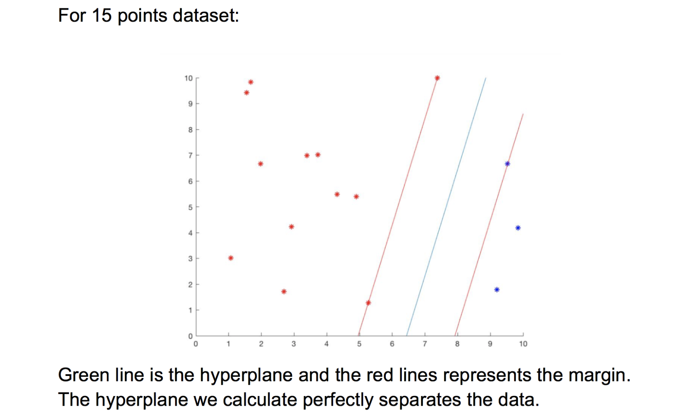
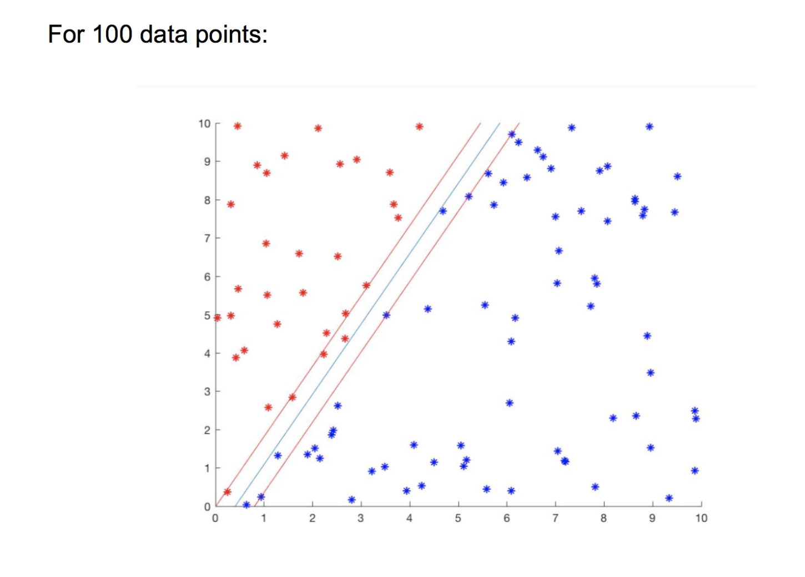

# EC500-HPC-Final-Project
EC500-HPC-Final-Project: SVM Solver
By Minghe Ren (sawyermh@bu.edu), Xinqiao Wei

The SVM.cpp can work properly, OMP and MPI version of code need to be furthur modified. 

